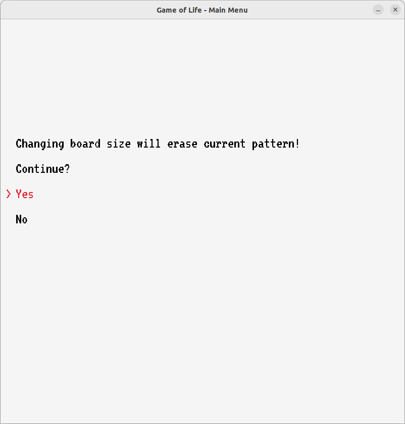

# GameOfLife

A simple implementation of Conway's Game of Life game. 

## How to play

In the game main menu, you have the following options:

- Use the default demo game board size.
- Specify the game board size.
    * Changing the size of the gameboard sets the default starting pattern

- Use default pattern
- Use random pattern
- Custom pattern

Once the game is started, you can choose one of the following options:

- P - Play: The game will continuously evolve the game board until you choose to stop.
- P - Pause: Pause the game at the current generation.
- SPACE - Step: The game will evolve the game board one generation at a time.
- S - Toggle speed: Switches the speed of evolutions between 0,5 - 0,1 seconds.
- R - Rainbow mode: Changes the color of the cell into rainbow colors
- Q - Quit: Returns the game's main menu.

## Dependencies

- Raylib

To install Raylib visit the site: https://github.com/raysan5/raylib and follow the instructions.  

## Build Project

1. Navigate to the project root directory

2. Create a build directory and navigate to it:

```shell
mkdir build
cd build
```

3. Run CMake and build the project:

```shell
cmake ..
make
```

## Run Project

```shell
./GameOfLife
```

## Run Unit Tests

```shell
../tests/unit_tests_results
```

## Team


[@An-Man](https://github.com/An-Man), [@soSkary](https://github.com/soSkary) & [@heidikrisse](https://github.com/heidikrisse)

## Screenshots

### Main Menu:


### Start with default pattern and default board size (50 x 50), rainbow mode selected with R:


### Default pattern (Copperhead) and default board size (50 x 50):


### Rainbow mode with random pattern:


### Confirm board size change:


### Invalid board size with red color:


### Valid board size with green color:


### Pattern Selection menu


